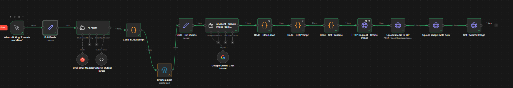
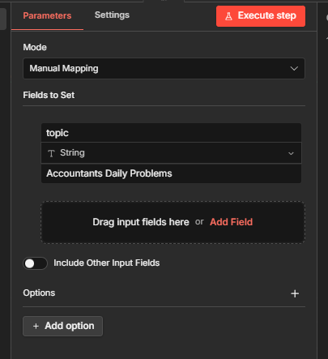

# 🚀 Automatic WordPress Blog Producer

An AI-powered automation workflow built with **n8n** that researches, writes, generates images, and publishes SEO-optimized blogs directly to WordPress. This system is specifically tailored for professional services, such as accounting, to ensure high-quality, relevant content with zero manual effort.

---

## 🛠 Features

- **Automated Research:** Uses AI to gather relevant data based on a provided topic.
- **SEO Optimization:** Automatically generates Meta Titles, Descriptions, Slugs, and Focus Keywords for the **Yoast SEO** plugin.
- **AI Image Generation:** Creates a unique, high-quality featured image for every post using Gemini.
- **WordPress Integration:** Automatically uploads media and creates posts as "Drafts" for final review.
- **Custom Structure:** Maintains a consistent layout (H1, Intro, Key Takeaways, Body) across all articles.

---

## 📸 Workflow Overview

### 1. The n8n Workflow
This is the "brain" of the operation. It connects the AI nodes to the WordPress REST API to handle the end-to-end process.

### 2. Topic Input & Configuration
You simply provide a topic or keyword, and the AI handles the research and metadata generation.

### 3. The Result
A fully formatted blog post, complete with a featured image and Yoast SEO settings filled out automatically.

---

## 🚀 How It Works

1.  **Trigger:** A new topic is entered into a Form or Google Sheet.
2.  **Text Generation:** Gemini AI writes the blog content in HTML and generates SEO metadata.
3.  **Image Creation:** Gemini creates a visual prompt and generates a `.jpg` featured image.
4.  **Media Upload:** The image is uploaded to the WordPress Media Library to get a `Media ID`.
5.  **Post Creation:** n8n sends the title, content, slug, and `Media ID` to WordPress.
6.  **SEO Update:** The workflow updates the `_yoast_wpseo` custom fields so the SEO lights are green from the start.

---
